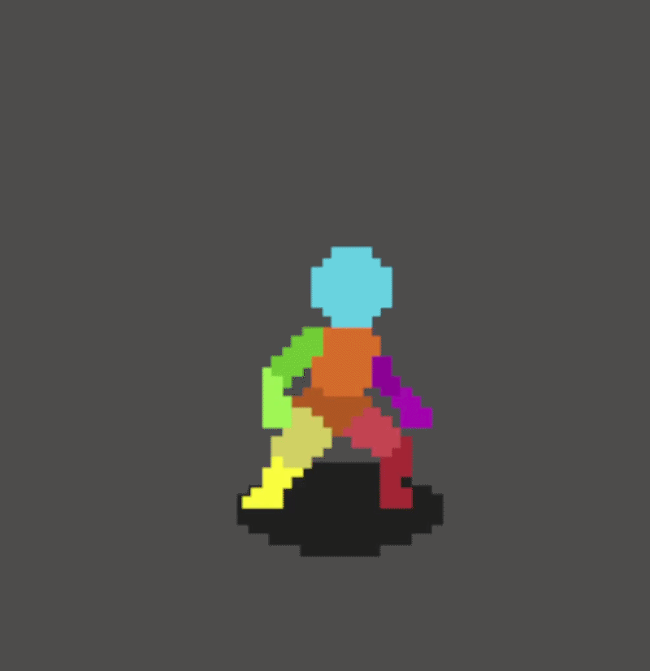

# Godot 4 Player Movement State Machine

A robust, scalable Finite State Machine (FSM) implementation for 2D character movement in Godot 4.4. 

This project demonstrates how to decouple complex character logic into isolated, manageable state scripts using the **Blackboard Pattern** and **Hierarchical States**, preventing the dreaded "spaghetti code" that usually comes with platformer or top-down controllers.

 

## 🌐 Live Demo
Play the web export right in your browser here: 
[Vercel deploy](https://complex-character.vercel.app/)

## ✨ Features
* **Decoupled Logic:** The `Player` acts as the blackboard (storing velocity, inputs, and physical memory), while independent `State` nodes handle the actual behavior.
* **Hierarchical State Machine:** States inherit from parent categories (e.g., `StateJump` and `StateFall` inherit from `StateOffGround` to share gravity math).
* **State Stack / Memory:** Allows the state machine to remember previous states and cleanly revert (perfect for hit-stun or pausing).
* **Smooth Animations:** Handles animation switching dynamically based on state entry and input direction without interrupting the game loop.
* **Web-Ready:** Configured for cross-origin isolation (SharedArrayBuffer) for easy deployment to Vercel or itch.io.

## 🏗️ Architecture / File Structure
The state machine is built on a clear inheritance tree to prevent code duplication:

* `state_machine.gd` - The manager that handles the active state and transitions.
* `base_state.gd` - The virtual base class all states inherit from.
  * **Ground States:**
    * `state_idle.gd` - Handles coming to a stop and resting.
    * `move_state.gd` - Parent class for horizontal movement.
      * `state_walk.gd` - Standard movement.
      * `state_run.gd` - Faster movement.
    * `state_crouch.gd` - Handles slowing down and shrinking the hitbox.
  * **Airborne States (`state_off_ground.gd`):** Handles gravity and air-strafing.
    * `state_jump.gd` - Upward momentum and variable jump heights.
    * `state_fall.gd` - Downward momentum and landing logic.

## 🚀 Getting Started

### Prerequisites
* [Godot Engine v4.4+](https://godotengine.org/)

### Installation
1. Clone this repository: `git clone https://github.com/YOUR-USERNAME/YOUR-REPO-NAME.git`
2. Open the Godot Project Manager and click **Import**.
3. Navigate to the cloned folder and select the `project.godot` file.
4. Open `world.tscn` and hit **Play** (F5)!

## 🎮 Controls (Default)
* **Move:** Left / Right Arrows or A / D
* **Jump:** Spacebar or Up Arrow
* **Crouch:** Down Arrow or S
* **Run:** Shift

